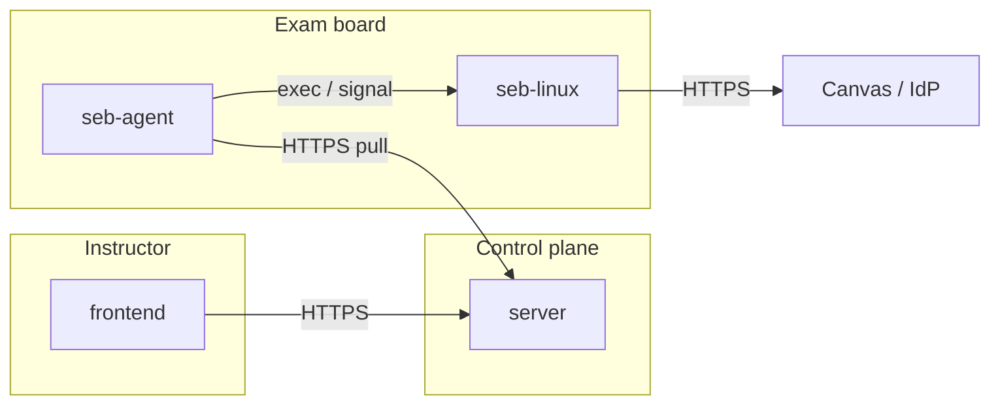

# exam-env

## 1. Purpose

An instructor, from a browser, selects an exam configuration (`.seb` or Linux JSON), sees which boards are available, starts the exam on some or all of them, and can force-stop. Students sit at boards that already run the OS and an agent. They never operate the control system.

---

## 2. Requirements

| ID  | Requirement                                                                                                                                                  |
| --- | ------------------------------------------------------------------------------------------------------------------------------------------------------------ |
| R1  | Instructor does not address boards by IP, SSH, or USB. Opening the UI is enough to see machines that are online.                                             |
| R2  | Boards use campus Wi‑Fi or Ethernet (eduroam). They initiate all control connections (HTTPS outbound).                                                       |
| R3  | Exam traffic (Canvas / IdP) is independent of the control channel.                                                                                           |
| R4  | A student who can reach the agent must not be able to replace the exam config. Configs are accepted only from the control server.                            |
| R5  | While SEB is running, remote commands are limited to status and stop.                                                                                        |
| R6  | The agent launches SEB in the active graphical seat, already privileged (`--anti-cheat`), with a local config path—no interactive `pkexec`.                  |
| R7  | The agent process must not resemble remote-desktop, packet-sniffing, or debugger tools; `seb-linux` terminates the exam if it detects that class of process. |

---

## 3. Architecture

Three components plus SEB. Control and exam share a board, not a process.

| Component   | Runs on                                                | Responsibility                                     |
| ----------- | ------------------------------------------------------ | -------------------------------------------------- |
| `frontend`  | Instructor’s browser (served with or next to `server`) | Fleet view, config upload, start, stop             |
| `server`    | Always-on host with a stable HTTPS name                | Inventory, config store, job queue                 |
| `seb-agent` | Each exam board                                        | Heartbeat, pull jobs, write config, start/stop SEB |
| `seb-linux` | Each exam board, only during an exam                   | Locked browser; unaware of exam-env                |

---

## 4. Machine and job model

**Machine state** (server’s view of one board):

| State     | Meaning                                                                     |
| --------- | --------------------------------------------------------------------------- |
| `offline` | No heartbeat within the timeout                                             |
| `idle`    | Agent up, SEB not running                                                   |
| `running` | SEB process is up                                                           |
| `error`   | Last start/stop failed, or SEB exited unexpectedly; last exit code recorded |

**Jobs** are the only way the server changes a board. An agent polls and executes at most one job at a time.

| Job      | Agent action                                                                                                                        |
| -------- | ----------------------------------------------------------------------------------------------------------------------------------- |
| *(none)* | Heartbeat only                                                                                                                      |
| `start`  | Write the current config to `/var/lib/seb/current.seb` (or `.json`); exec `safe-exam-browser --anti-cheat <path>`; report `running` |
| `stop`   | SIGTERM the SEB process; escalate if needed; report `idle` and exit status                                                          |

---

## 5. Interfaces

Wire format is unspecified until implementation. Semantically:

**Agent → server**

- Register / heartbeat: identity (hostname, agent/SEB version), state, optional last exit code
- Pull: next job and, on `start`, the config bytes (or a content hash the agent already has)

**Frontend → server**

- List machines
- Upload/select config
- Enqueue `start` or `stop` for one machine or the selection

**Agent → OS**

- Write config under `/var/lib/seb/`
- Start SEB with a local path and `--anti-cheat`
- Signal the SEB pid on stop

